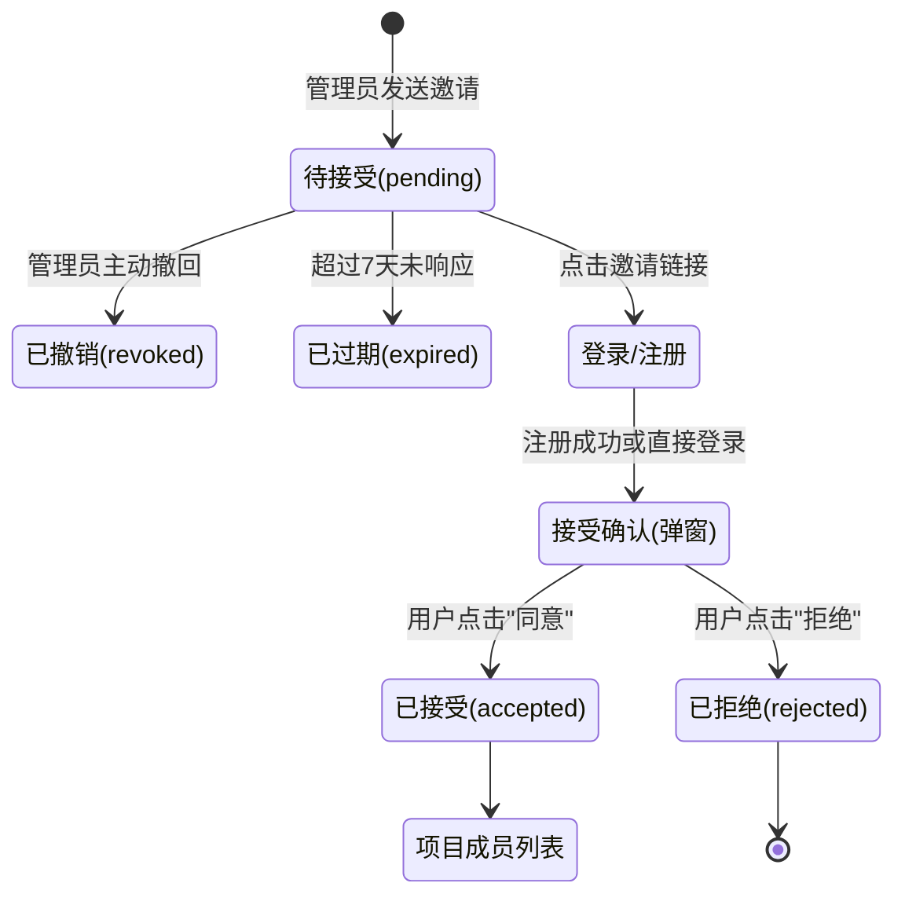

# 项目成员邀请系统前端交互原型图

本文件通过 Markdown 与 Mermaid 图表展示了项目成员手机号邀请的前端交互流程，包括邀请弹窗、接受确认与注册引导等关键场景。

## 1. 邀请流程总览 (状态机)



## 2. 前端界面原型设计

### 2.1 邀请发送面板 (批量邮箱/手机号输入)

此界面供项目管理员使用，在项目成员设置页面的顶部展示。

```text
+-------------------------------------------------------------+
| 项目设置 - 成员管理                                         |
+-------------------------------------------------------------+
| [邀请新成员]                                                |
| 被邀请人将以 **访客** 身份加入，可在加入后修改角色。        |
|                                                             |
| +---------------------------------------------------------+ |
| | 批量输入手机号或邮箱，用逗号、分号或换行分隔...         | |
| |                                                         | |
| +---------------------------------------------------------+ |
|                                                             |
| [短信/邮件通知 v] [复制项目通用邀请链接]       [ 发送邀请 ] |
+-------------------------------------------------------------+
| 待处理邀请列表:                                             |
| 13800000000 · 待接受 · 角色: 访客 · 最近发送 2026-04-13   |
|   [重发] [撤销]                                             |
+-------------------------------------------------------------+
```

### 2.2 用户接收邀请与注册引导流程

当未注册用户收到短信并点击链接时，进入注册引导流程。

```text
+-------------------------------------------------------------+
| 手机号快捷注册                                              |
+-------------------------------------------------------------+
| 欢迎加入 GeoYun 系统，您收到了一份项目邀请！                |
|                                                             |
| 手机号：[ 13800000000                     ] (已锁定)        |
| 验证码：[ 请输入6位短信验证码 ] [ 获取验证码 ]              |
| 密码：  [ 请设置登录密码                ]                   |
|                                                             |
|                    [ 注册并继续 ]                           |
+-------------------------------------------------------------+
```

### 2.3 接受邀请确认弹窗

无论是新注册用户，还是已注册用户登录后，系统首页都会自动弹出该确认框。

```text
+-------------------------------------------------------------+
| 收到新的项目邀请                                     [ X ]  |
+-------------------------------------------------------------+
|                                                             |
|  [头像] 张晨 邀请您加入项目 "城市空间规划数据集"            |
|                                                             |
|  分配角色：访客                                             |
|  邀请时间：2026-04-13 10:00                                 |
|                                                             |
|                                                             |
|                    [ 拒绝 ]   [ 同意并加入 ]                |
+-------------------------------------------------------------+
```

## 3. 错误与反馈提示规范

- **发送成功**：`Toast.success("成功发送 1 条邀请")`
- **防刷限制**：`Toast.error("重发失败：该手机号24小时内邀请次数已达上限(3次)")`
- **同意邀请**：`Toast.success("已成功加入项目")`
- **拒绝邀请**：`Toast.info("您已拒绝加入该项目")`
